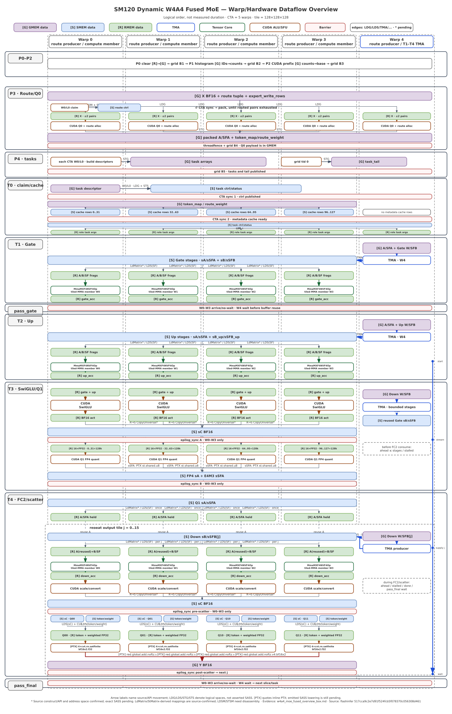

# W4A4 Fused MoE Diagram Comparison

Both alternatives describe the same source-derived execution and data movement. The current `kernel_design.md` is intentionally unchanged until one presentation is selected.

## A. Text-box overview

See [w4a4_moe_fused_overview_box.md](w4a4_moe_fused_overview_box.md).

This version is easy to diff and edit in source control, but it is constrained by terminal width.

## B. Draw.io overview

- Editable source: [w4a4_moe_fused_overview.drawio](w4a4_moe_fused_overview.drawio)
- Generated preview: [w4a4_moe_fused_overview.svg](w4a4_moe_fused_overview.svg)
- Reproducible generator: [generate_w4a4_moe_overview.py](generate_w4a4_moe_overview.py)

The Draw.io version preserves fixed Warp 0–4 lanes, phase boxes, memory-space fills, copy mechanisms, barriers, and the bounded Warp 4 Down-TMA producer rail.

Its visual grammar is deliberately strict:

- light purple = GMEM data;
- light blue = SMEM data;
- light green = RMEM data;
- memory boxes contain data names only;
- edge labels carry movement or execution mechanisms such as `LDG`, `LDS`, `TMA`, `LdMatrix`, `STS`, and `RED.global`.

## Practical comparison

| Need | Text boxes | Draw.io |
|---|---|---|
| Understand the whole fused flow at first glance | Fair; terminal width limits grouping | Best; phases, lanes, shared shelves, and the W4 rail are spatial |
| Inspect exact source-derived details | Best; labels can remain verbose | Good; intentionally keeps only overview-level evidence |
| Read inline in Markdown | Best | Good through the generated SVG |
| Review changes in Git | Best; ordinary text diff | Generator is diffable; generated XML/SVG are noisier |
| Rearrange or present visually | Limited | Best; the `.drawio` file remains editable |

Recommended use: place the Draw.io/SVG overview near the top of `kernel_design.md`, then keep the text-box view—or a fact table derived from it—as the source-audit layer. The current `kernel_design.md` remains the facts source and has not been modified by this comparison.

## Evidence notation

- `✓SRC`: address space, CuTe API, or inline PTX is confirmed from source.
- `△SASS`: the exact emitted SASS mnemonic, cache behavior, or reduction granularity still requires compilation/disassembly.
- In the Draw.io overview, `LDG/LDS/STG/STS` name logical source/destination spaces; they do not assert an exact emitted SASS mnemonic. `[PTX]` quotes an inline-PTX operation, while its emitted SASS lowering is still pending. `*` means the source construct/API and address space are confirmed but exact SASS is pending; for `LdMatrix` and StMatrix-derived `CopyUniversal`, that specifically means `LDSM/STSM` still needs disassembly.
